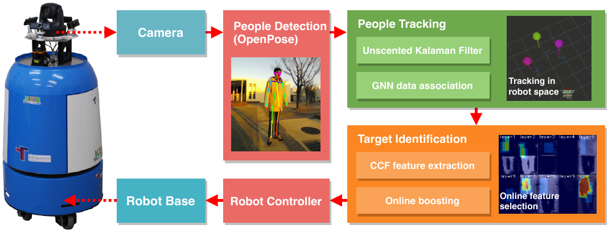
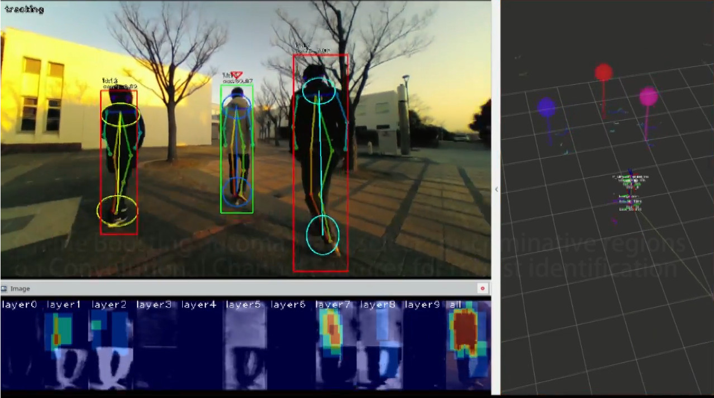

# monocular_person_following

This package provides a monocular vision-based person tracking and identification framework for person following robots. It first detects people using *tf-pose-estimation*, and then track them in the robot space with Unscented Kalman filter with the ground plane information. The combination of Convolutional Channel Features and Online Boosting runs on the top of the tracking module to keep tracking the target person with a re-identification capability. The entire system is designed so that it can be run on a Jetson TX2/Xavier, and it can easily be reproduced and reused on a new mobile robot platform.

[[video]](https://www.youtube.com/watch?v=SsIrXxnOgaQ)

  on kinetic & melodic

## Dependencies

- dlib
- flann
- tensorflow
- tf-pose-estimation

## Quick Test

[Quick test (Desktop PC with CUDA >= 10.2/Jetson Xavier with Jetpack 4.5.1)](https://github.com/koide3/monocular_person_following/wiki/Quick-test-with-USB-cam)

## Install

We tested this package on Xavier/Jetpack 4.5.1  
Note: We recommend using docker to avod the painful installation process

- [[Install from source (Jetson Xavier with Jetpack 4.5.1)]](https://github.com/koide3/monocular_person_following/wiki/%5BJetpack-4.5%5D-Install-from-source)

## Setup your own person following robot

[[Setup your robot]](https://github.com/koide3/monocular_person_following/wiki/Setup-your-own-person-following-robot)

## Related packages

- [ccf_person_identification](https://github.com/koide3/ccf_person_identification)
- [monocular_people_tracking](https://github.com/koide3/monocular_people_tracking)
- [monocular_person_following](https://github.com/koide3/monocular_person_following)

## Papers
- Kenji Koide, Jun Miura, and Emanuele Menegatti, Monocular Person Tracking and Identification with Online Deep Feature Selection for Person Following Robots, Robotics and Autonomous Systems [[link]](https://www.researchgate.net/publication/336871285_Monocular_Person_Tracking_and_Identification_with_On-line_Deep_Feature_Selection_for_Person_Following_Robots).

- Kenji Koide and Jun Miura, Convolutional Channel Features-based Person Identification for Person Following Robots, 15th International Conference IAS-15, Baden-Baden, Germany, 2018 [[link]](https://www.researchgate.net/publication/325854919_Convolutional_Channel_Features-Based_Person_Identification_for_Person_Following_Robots_Proceedings_of_the_15th_International_Conference_IAS-15).
